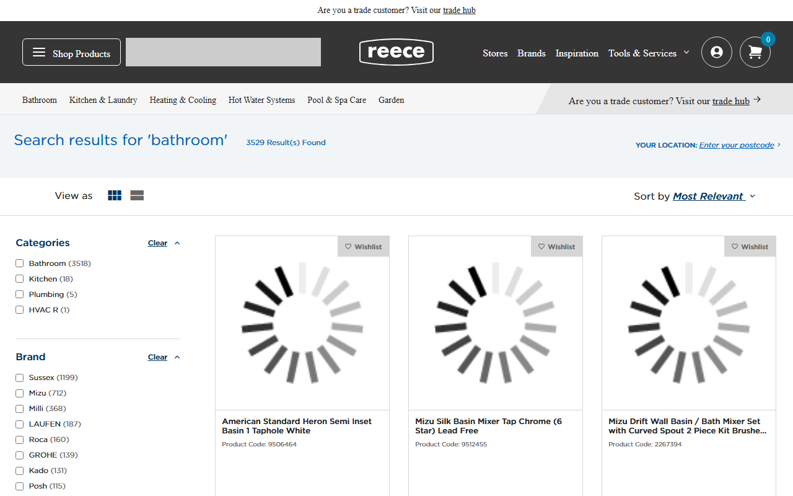
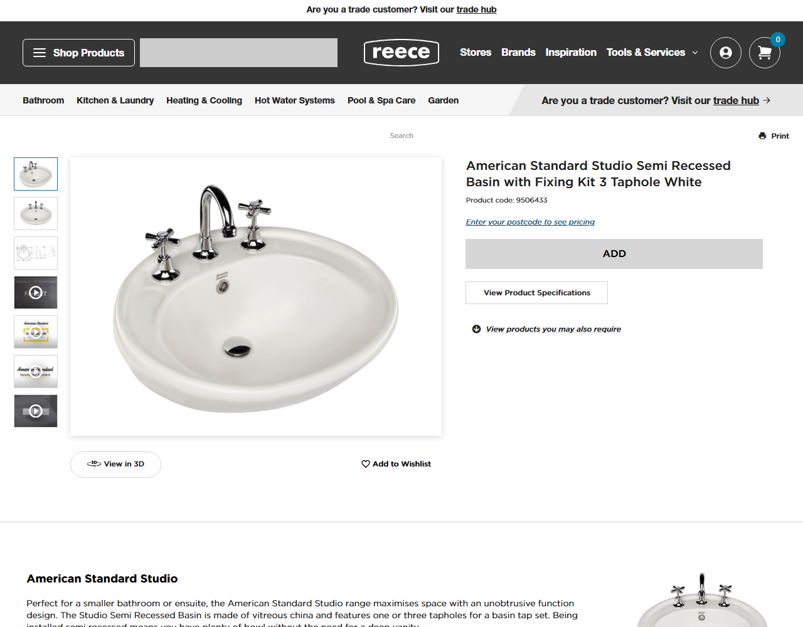

# Reece Product Catalogue Scraper

A production-style **Python + Playwright** scraper that extracts structured product data from [Reece Australia](https://www.reece.com.au/) — one of AU’s largest plumbing and bathroom suppliers.

Built to demonstrate large-catalogue e-commerce scraping: pagination, dynamic pages, postcode-based pricing, checkpoint resume, and clean CSV export.

---

## Features

| Capability | Details |
|---|---|
| Multi-category crawl | Bathroom, kitchen & laundry, heating & cooling, hot water, pool & spa, garden, plumbing |
| Product fields | Name, SKU, brand, category hierarchy, description, price, images, PDFs, specifications |
| Location-aware pricing | Sets an Australian postcode in-browser before scraping (prices are region-dependent) |
| Resumable runs | Checkpoint file tracks discovered + visited URLs so interrupted jobs can continue |
| Rate limiting | Delay between product requests; retries on transient failures |
| Structured output | Appends rows to `products.csv` ready for analysis or ETL |

---

## Tech stack

- **Python 3.10+**
- **[Playwright](https://playwright.dev/python/)** (Chromium) — handles JS-rendered product pages
- **CSV + JSON** — output and checkpoint persistence
- Standard library only besides Playwright (`csv`, `json`, `re`, `urllib`, `pathlib`)

---

## Architecture

```text
┌─────────────────┐     discover links      ┌──────────────────┐
│  Category search│ ──────────────────────► │ checkpoint.json  │
│  + pagination   │                         │ (discovered URLs)│
└─────────────────┘                         └────────┬─────────┘
                                                     │
                                                     ▼
┌─────────────────┐     scrape details      ┌──────────────────┐
│  Product pages  │ ──────────────────────► │  products.csv    │
│  + specs / PDFs │                         │  (structured)    │
└─────────────────┘                         └──────────────────┘
        ▲
        │ postcode set once per browser context
┌───────┴─────────┐
│  Delivery modal │
│  (e.g. 3000)    │
└─────────────────┘
```

1. Open a product page and set the delivery **postcode** so location-specific prices can load.
2. Crawl each category search URL, follow pagination, collect `/product/` links.
3. Visit each product, extract fields, append to CSV, mark URL visited in the checkpoint.

---

## Sample output

See [`data/sample_products.csv`](data/sample_products.csv) for example rows.

Columns:

`product_name`, `sku`, `brand`, `category`, `description`, `price`, `image_urls`, `document_urls`, `specifications`, `product_url`

---

## Screenshots

| Search listings | Product detail |
|---|---|
|  |  |

More captures live under [`docs/assets/`](docs/assets/).

---

## Quick start

### 1. Clone & create a virtual environment

```bash
git clone https://github.com/bmotana/reece-scraper.git
cd reece-scraper

python -m venv venv

# Windows
venv\Scripts\activate

# macOS / Linux
source venv/bin/activate
```

### 2. Install dependencies

```bash
pip install -r requirements.txt
playwright install chromium
```

### 3. Configure (optional)

In `scraper.py`:

| Setting | Purpose |
|---|---|
| `POSTCODE` | Australian postcode for pricing (default `3000` — Melbourne CBD) |
| `MAX_PAGES_PER_CATEGORY` | Cap pages per category for test runs; set to `None` for full crawl |
| `START_URLS` | Category search entry points |

### 4. Run

```bash
python scraper.py
```

Output:

- `products.csv` — scraped catalogue rows  
- `checkpoint.json` — progress so you can stop and resume safely  

Delete `checkpoint.json` (and optionally `products.csv`) to start a fresh discovery pass.

---

## Project layout

```text
reece-scraper/
├── scraper.py              # Main scraper
├── requirements.txt
├── pyproject.toml
├── LICENSE
├── README.md
├── data/
│   └── sample_products.csv # Demo rows for the portfolio
├── docs/
│   ├── project-scope.md    # Original brief / scope
│   └── assets/             # UI screenshots
└── tests/
    └── test_scraper.py     # Unit and integration tests
```

Runtime files (`products.csv`, `checkpoint.json`, `venv/`) are gitignored.

---

## Responsible use

This project is for **learning, portfolio demonstration, and authorized data work**. Before scraping at scale:

- Review [Reece’s terms of use](https://www.reece.com.au/) and robots guidance
- Prefer official APIs or licensed data feeds when available
- Keep request rates modest; do not overload production sites
- Use extracted data only in ways that comply with applicable law and site policies

---

## License

MIT — see [LICENSE](LICENSE).
